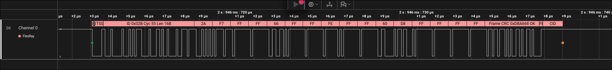

# FlexRay Logic 2 Analyzer

Low-level Saleae Logic 2 analyzer for FlexRay communication elements.

## Current Scope

- Decodes FlexRay frames from a single digital input.
- Recognizes wakeup symbols (`WUS`) and groups consecutive symbols into wakeup patterns (`WUP`).
- Verifies header CRC and frame CRC for channel A or channel B.
- Exports decoded frames, symbols, and syntax errors as CSV.
- Accepts all valid received TSS widths from `3..15` bits without per-capture tuning.
- Recognizes `CAS` symbols using a timing window instead of treating every malformed start as a symbol.
- Includes a Logic 2 automation script for regression-checking the reference capture in `assets/SP2018_FlexRay.sal`.

## Analyzer Settings

- `Input Channel`: captured FlexRay signal.
- `Bit Rate (Bits/s)`: `10 Mbit/s`, `5 Mbit/s`, or `2.5 Mbit/s`.
- `CRC Channel`: FlexRay channel A or B.
- `Sample Point (%)`: decoder sample point after clock recovery. Default is `62`.
- `Invert Input`: invert the digital signal before decoding.

## Build

```bash
cmake -S . -B build
cmake --build build
```

Built analyzer:

```text
build/Analyzers/libFlexRayAnalyzer.so
```

## Decoding Example


